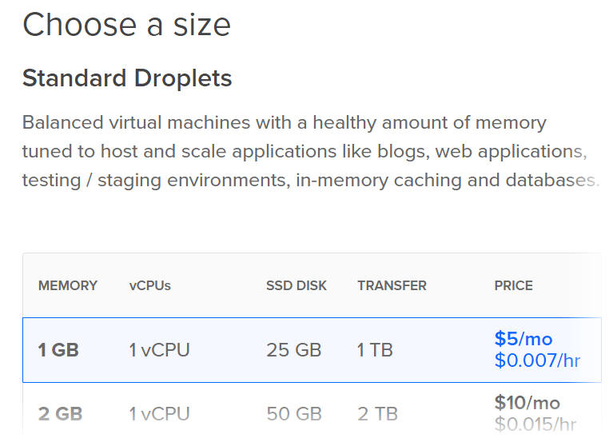

Linux Ubuntu swap 交换文件优化
===================

我们在 [Digital Ocean](https://m.do.co/c/89497bd485e0) 创建 VPS (Droplet) 时，最便宜的配置如下：

内存是 1GB，一般情况下是够用了，如果多开几个 shadowsocks 进程，多个用户同时上 youtube.com，那么内存可能会不够用，怎么办

可以设置 swap 交换文件。DO 硬盘都是 SSD，内存不够时可以使用硬盘的swap，速度也不错

---

注意:

尽管通常建议对使用传统旋转硬盘驱动器的系统进行交换，但使用SSD交换可能会导致硬件随着时间的推移而出现问题。 出于这种考虑，通常不建议在使用SSD存储的提供商上启用交换文件。 这样做会影响您和您的邻居的底层硬件的可靠性

检查系统是否设置过 swap
-----------

在开始之前，我们可以检查系统是否已经有一些可用的交换空间。 可以有多个交换文件或交换分区，但通常一个就足够了

我们可以通过键入以下内容来查看系统是否已配置了交换文件

    sudo swapon - show

如果您没有收到任何输出，这意味着您的系统当前没有可用的交换空间

您可以使用 free 验证没有活动交换空间：

    free -h

检查硬盘驱动器分区上的可用空间
--------------

为交换分配空间的最常用方法是使用专用于该任务的单独分区。 但是，改变分区方案并不总是可行的。 我们可以轻松创建驻留在现有分区上的交换文件

在我们这样做之前，我们应该键入以下内容来检查当前磁盘使用情况：

    df -h

有足够的可用空间的时候，我们才能创建 swap 文件

创建 swap 交换文件
----------

现在我们知道了可用的硬盘空间，我们可以在文件系统中创建一个交换文件。 我们将在根（/）目录中创建一个我们想要的交换大小的文件

创建交换文件的最佳方法是使用fallocate程序。 此命令立即创建预分配大小的文件

由于我们示例中的服务器具有1024MB的RAM，因此我们将在本教程中创建3 GB的文件。 调整此项以满足您自己的服务器的需求：

    sudo fallocate -l 3G / swap

我们可以通过输入以下内容来验证是否保留了正确的空间量：

    $ ls -lh /swap
    -rw-r - r-- 1 root root 3.0G Dec 19 11:14 /swap

启用 swap 交换文件
---------

现在我们有一个正确大小的文件，我们需要实际将其转换为交换空间

首先，我们需要锁定文件的权限，以便只有具有root权限的用户才能读取内容。这可以防止普通用户访问该文件，这会产生重大的安全隐患

通过键入以下内容使该文件只能由root访问：

    sudo chmod 600 /swap

键入以下命令验证权限更改：

    $ ls -lh /swap
    -rw ------- 1 root root 3.0G Dec 19 11:14 /swap

如您所见，只有root用户启用了读写标志

我们现在可以通过键入以下内容将文件标记为交换空间

    sudo mkswap /swap

标记文件后，我们可以启用交换文件，允许我们的系统开始使用它：

    sudo swapon /swap

我们可以通过输入以下内容来验证交换是否可用：

    sudo swapon - show

可以再次检查：

    $ free -h
                  total        used        free      shared  buff/cache   available
    Mem:           985M         96M        113M        1.6M        775M        727M
    Swap:          3.0G        268K        3.0G

使 swap 交换文件永久化
-----------------

我们最近的更改已启用当前会话的交换文件。 但是，如果我们重新启动，服务器将不会自动保留交换设置。 我们可以通过将交换文件添加到 `/etc/fstab` 文件来更改此设置

备份 `/etc/fstab` 文件，以防出现任何问题：

    sudo cp /etc/fstab /etc/fstab.bak

您可以通过键入以下内容将交换文件信息添加到 `/etc/fstab` 文件的末尾：

    echo'/swap none swap sw 0 0'| sudo tee -a /etc/fstab

调整swap交换文件设置
---------

您可以配置一些选项，这些选项会在处理交换时对系统的性能产生影响

调整 Swappiness 属性

swappiness参数配置系统将数据从RAM交换到交换空间的频率。这是介于0和100之间的值，表示百分比

值接近于零时，除非绝对必要，否则内核不会将数据交换到磁盘。请记住，与交换文件的交互是“昂贵的”，因为它们比与RAM的交互花费更长的时间，并且它们可能导致性能的显着降低。告诉系统不要太依赖交换通常会使您的系统更快

接近100的值将尝试将更多数据放入交换中以努力保持更多RAM空间。根据应用程序的内存配置文件或服务器的使用情况，在某些情况下可能会更好

我们可以通过输入以下内容来查看当前的swappiness值：

    $ cat /proc/sys/vm/swappiness
    60

对于桌面，swappiness设置为60并不是一个糟糕的值。对于服务器，您可能希望将其移近0

我们可以使用sysctl命令将swappiness设置为不同的值

例如，要将swappiness设置为10，我们可以输入：

    $ sudo sysctl vm.swappiness = 10
    vm.swappiness = 10

要使设置在重启系统后仍然生效，建议把自定义设置保存到 /etc/sysctl.d 目录下

    $ sudo vi /etc/sysctl.d/98-swap.conf
    vm.swappiness = 10

调整 Cache Pressure 缓存压力设置
-------

您可能想要修改的另一个相关值是 vfs_cache_pressure。此设置配置系统将选择多少缓存inode和dentry信息而不是其他数据

基本上，这是关于文件系统的访问数据。这通常是非常昂贵的查询和非常频繁的请求，所以这是你的系统缓存的一个很好的事情。您可以通过再次查询proc文件系统来查看当前值：

    $ cat /proc/sys/vm/vfs_cache_pressure
    100

由于它当前已配置，我们的系统会过快地从缓存中删除inode信息。我们可以通过键入以下内容将其设置为更保守的设置（如50）：

    $ sudo sysctl vm.vfs_cache_pressure = 50
    vm.vfs_cache_pressure = 50

同样，我们要把这个设置保存到 /etc/sysctl.d/98-swap.conf 文件中：

    $ sudo vi /etc/sysctl.d/98-swap.conf
    vm.vfs_cache_pressure = 50

我们把自定义内核参数设置都保存到 `/etc/sysctl.d/` 目录下，并且文件名以 98 开头，当我们创建一个新的 VPS 时，可以轻松地用 `tar` 命令把 `/etc/sysctl.d/98*` 文件打包并迁移到新的环境中。你可以在下面地址查看内核参数优化文件：

https://github.com/softwaredownload/openwrt-fanqiang/tree/master/ubuntu/etc/sysctl.d

**相关资源**：

- https://github.com/softwaredownload/openwrt-fanqiang/blob/master/ubuntu/etc/sysctl.d/98-swap.conf